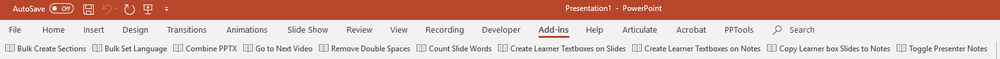

# PPT Macros (as of Oct 4, 2019)

## Bulk Create Sections

Prompts the user for a number, optional prefix, or optional suffix and then
generates that many sections. Great for easily creating: Module 1, Module 2..
etc.

## Bulk Set Language

Prompts the user if they need UK English or US English. The macro loops through
each shape on each slide and each shape on each notes page and set the proofing
language.

## Combine PPTX

Open the first module in a folder of PowerPoint files and this button will
append them to the currently open file and put each file in a separate section
named: Module 1, Module 2, etc. Rename files in the folder with XX numbers to
ensure proper order. Example: 01, 02, 03, etc.

## Go to Next Video

Start on slide 1 and press the button. The macro will search forward, and the
macro will stop on the next slide that contains a video object. Great for
swapping out translated videos. It will always search the currently displayed
slide as well so the user may have to advance to the next slide to continue
searching.

## Go to Next Image

Start on slide 1 and press the button. The macro will search forward, and the
macro will stop on the next slide that contains an image object.

## Remove Double Spaces

Searches every object on every slide and if there is text that has two spaces in
sequence then it will replace those spaces with a single space.

## Count Slide Words

Counts the words on all slides and reports the average word count per slide as
well as the slides that have the least and most words.

## Go to Slide

Prompts the user for a slide number to quickly go to that slide. Great for large presentations.

## Reset to Theme Font

Resets all titles, notes, and text to the main theme font.

## Export all Comments

Exports all comments throughout the document to a text file which is saved on the desktop and titled PPT_Comments.

## Create Learner Textboxes on Slides

This macro will create 3 textboxes on the outside boundaries of every slide:
learner notes, minutes, and objective. Minutes should be a number only and
objective should also be a number. This macro can be run as many times as needed
as it will reposition the textboxes if they already exist and are skewed and it
will create the textboxes if they are missing. This macro pairs with the macros:
“Create Learner textboxes on Notes” and “Copy Learner box slides to notes”.

## Create Learner Textboxes on Notes

This macro will create 3 textboxes on the notes handout page of each slide:
learner notes, minutes, and objective. Minutes should be a number only and
objective should also be a number. This macro can be run as many times as needed
as it will reposition the textboxes if they already exist and are skewed and it
will create the textboxes if they are missing. This macro pairs with the macros:
“Create Learner textboxes on Slides” and “Copy Learner box slides to notes”.

## Copy learner box slides to Notes

This macro will copy the contents of the following textboxes on a slide to their
notes handout equivalent: learner notes, objective, minutes. This macro will
reset the fonts of the notes page to size 11, remove bold italics and underline,
and set the font to the default theme font for the document.

## Toggle Presenter Notes

Prompts the user to hide or show presenter notes on the notes page. This macro
will toggle the visibility of the presenter notes on the notes handout pages of
every slide. Great for outputting a presenter guide and then a participant
guide.

# Installing Toolbar

## Show the Developer Tab

The developer tab is needed to interact with macros and custom toolbars. On the
File tab, go to Options \> Customize Ribbon. Under Customize the Ribbon and
under Main Tabs, select the Developer check box.

## Load Add-in

From the developer tab (see above), select “PowerPoint Add-Ins” “Add New”.
Find the add-in that you want to load. If you don’t
see the “Add-In” toolbar appear at the top then select “Unload” and then “Load”
to reset the toolbar. This add-in should remain loaded until you completely
close PowerPoint.

## Error or Remove Add-In

If there is an issue or you need a newer version then access the developer tab
“Powerpoint Add-Ins” and select the add-in and then select the “remove”
button. Reopen PowerPoint.

